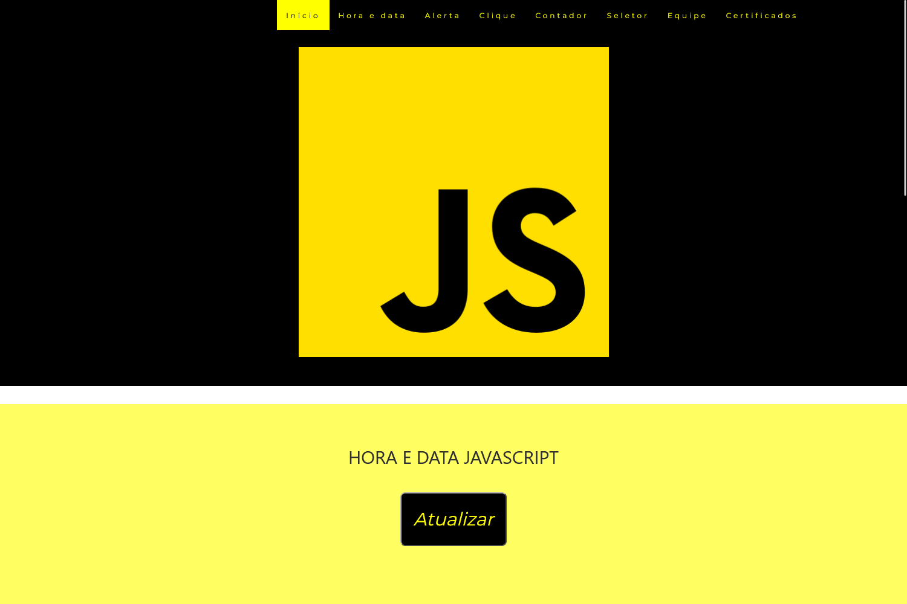

# JavaScript Workshop Rio Pomba Valley

> Sobre

Projeto construído objetivando demonstrar um pouco do funcionamento de algumas funções do JavaScript para os alunos do Rio Pomba Valley da turma de Back-end.

[🔗 Clique aqui para acessar](https://kennylima.github.io/Javascript_Workshop_RPV/)

## 🛠 Tecnologias 
- HTML
- CSS
- JavaScript
- Git
- Github

## 💻 Contato 

 > kennylima@hotmail.com